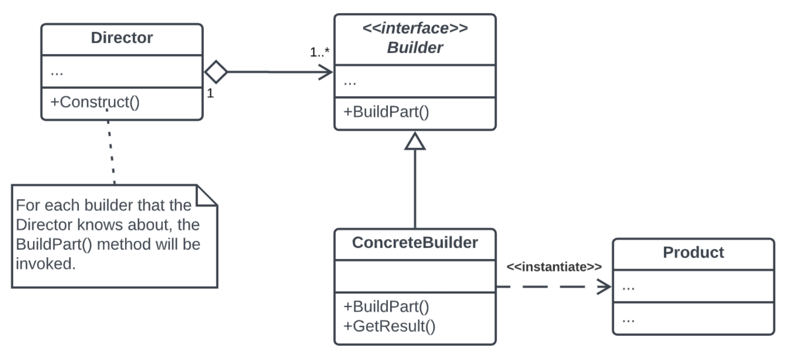

# Builder Design Pattern

## What it is

The **Builder design pattern** is a creational pattern that separates the construction of a complex object from its representation. It provides a step-by-step approach to constructing objects, allowing you to create different variations of an object while keeping the construction process consistent. The pattern is particularly useful when you have objects with many optional parameters or configurations.

## Where to use it

1. **Complex Object Creation:** Use the Builder pattern when you need to create complex objects with numerous optional parameters or configurations. It keeps the construction code clean and allows for clear separation of concerns.

2. **Immutability:** When you want to ensure that the constructed objects are immutable (their state cannot be changed after creation), the Builder pattern is helpful because it allows you to set the properties during construction and then make the object immutable.

3. **Fluent Interfaces:** The Builder pattern often leads to fluent interfaces, which make code more readable and allow method chaining, enhancing the clarity of object creation.

### Pros

1. **Separation of Concerns:** It separates the construction process from the representation, promoting cleaner and more maintainable code.

2. **Flexible Construction:** The pattern allows you to create different configurations of an object with ease by adjusting the builder's methods.

3. **Readability:** Fluent interfaces, often associated with the Builder pattern, lead to more readable and self-documenting code.

### Cons

1. **Complexity:** For simpler objects with only a few properties, using the Builder pattern might be overkill and add unnecessary complexity.

2. **Additional Code:** Implementing the Builder pattern requires writing additional classes and methods, which can increase code volume.

In summary, the Builder design pattern is a valuable tool for creating complex objects step by step, providing flexibility, maintainability, and readability in situations where objects have many optional parameters or configurations. It's particularly useful when you need to ensure immutability or want to achieve a fluent interface for object creation.